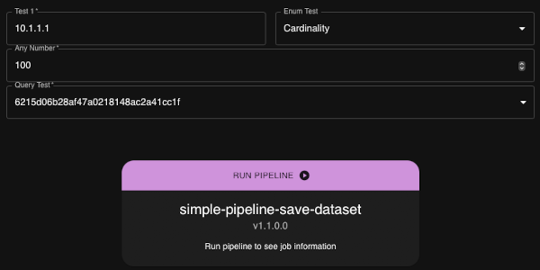
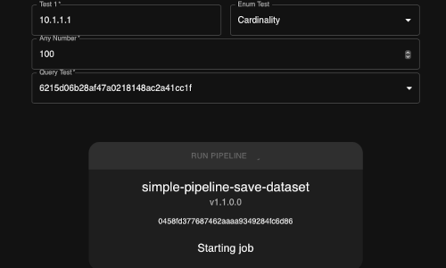
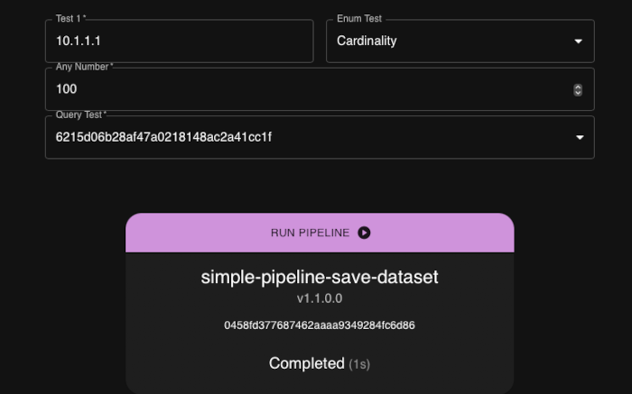

# Run Pipeline custom widget in react
This widget allows the execution of a pipeline using a [JSON Form](https://jsonforms.io). The widget is 
customizable using fixed variables provided by the dashboard.

This widget displays the form, and sends the data provided in the form as input to the pipeline, as a single row of data. Pipeline should use `@exec:get-input` to access the input.





# Using the widget
## Fixed variables
Fixed variables are used to customize this widget. 

### List of variables
- `schema`* (object) &rarr; The [JSON Schema](https://json-schema.org/) used to generate the input JSON form
- `uiSchema` (object) &rarr; The [UI Schema](https://jsonforms.io/docs/uischema/) used for the JSON form
- `pipeline`* (string) &rarr; The name of the pipeline to use
- `pipelineVersion`* (string) &rarr; The version of the pipeline to use
- `pipelinePublished`* (boolean) &rarr; Whether the pipeline is published or a draft
- `sites` (string) &rarr; Regular expression to select worker to run the pipeline
  - Default: `.*`
- `runButtonText` (string) &rarr; The text to display on the button to run the pipeline
  - Default: `Run Pipeline`
- `runButtonColor` (string) &rarr; The theme color to use for the run pipeline button
  - Default: `secondary`
- `showPipeline` (boolean) &rarr; Whether to show the name and version of the pipeline
  - Default: `true`
- `showJobId` (boolean) &rarr; Whether to show the job id of the currently executing job
  - Default: `true`

\* required

## Enum options from pstream
Using the UI Schema, enum values for a string element can be generated during runtime using
values from a persistent stream. To do this, provide the `apiUrl` option to query the stream.

The `valueField` option determines which field to use as the value. If the `labelField` option
is provided, it is used as the label for the enum value which is shown to the user.

Alternatively, the `jq` option can be provided to obtain enum values using a [jq filter](https://jqlang.org/).
This option will override `valueField`.

## Example usage in a dashboard

<details>
<summary>Example 1</summary>
  
```json
{
  "title": "Run Pipeline",
  "widget_type": "custom_widget",
  "widget_implementation": "run_pipeline/run_pipeline",
  "min_width": 6,
  "max_width": 12,
  "height": 8,
  "fixed_variables": {
    "schema": {
      "type": "object",
      "properties": {
        "test1": {
          "type": "string",
          "title": "Test 1"
        },
        "test2": {
          "type": "string",
          "title": "Test 2"
        },
        "enum_test": {
          "title": "Enum Test",
          "type": "string",
          "enum": [
            "Min",
            "Max",
            "Avg",
            "Sum",
            "Cardinality"
          ]
        },
        "num_test": {
          "type": "number",
          "title": "Any Number"
        }
      },
      "required": [
        "test1",
        "num_test"
      ]
    },
    "pipeline": "simple-pipeline-save-dataset",
    "pipelineVersion": "1.1.0.0",
    "pipelinePublished": false
  }
}
```
</details>

<details>
<summary>Example 2 (values from pstream)</summary>
  
```json
{
  "title": "Run Pipeline",
  "widget_type": "custom_widget",
  "widget_implementation": "run_pipeline/run_pipeline",
  "min_width": 6,
  "max_width": 12,
  "height": 8,
  "fixed_variables": {
    "schema": {
      "type": "object",
      "properties": {
        "test1": {
          "type": "string",
          "title": "Test 1"
        }
      },
      "required": [
        "test1"
      ]
    },
    "uiSchema": {
      "type": "VerticalLayout",
      "elements": [
        {
          "type": "Control",
          "scope": "#/properties/test1",
          "options": {
            "apiUrl": "/api/v2/pstreams/pstream/my_pstream/data?offset=0&limit=100",
            "labelField": "Name",
            "valueField": "Timestamp"
          }
        }
      ]
    },
    "pipeline": "simple-pipeline-save-dataset",
    "pipelineVersion": "1.1.0.0",
    "pipelinePublished": false
  }
}
```
</details>

<details>
<summary>Example 3 (values from pstream using jq)</summary>
  
```json
{
  "title": "Run Pipeline",
  "widget_type": "custom_widget",
  "widget_implementation": "run_pipeline/run_pipeline",
  "min_width": 6,
  "max_width": 12,
  "height": 8,
  "fixed_variables": {
    "schema": {
      "type": "object",
      "properties": {
        "test1": {
          "type": "string",
          "title": "Test 1"
        }
      },
      "required": [
        "test1"
      ]
    },
    "uiSchema": {
      "type": "VerticalLayout",
      "elements": [
        {
          "type": "Control",
          "scope": "#/properties/test1",
          "options": {
            "apiUrl": "/api/v2/pstreams/pstream/my_pstream/data?offset=0&limit=100",
            "jq": ".Name"
          }
        }
      ]
    },
    "pipeline": "simple-pipeline-save-dataset",
    "pipelineVersion": "1.1.0.0",
    "pipelinePublished": false
  }
}
```
</details>

# Pre-requisites
* Install node.js, by following instructions at: https://nodejs.org/en/download
* Ensure node and npm are available on you machine 
```
node --version
npm --version
```

* Make sure python >=3.7 and pip is installed.
* Make sure `requests` library is installed (pip install requests)

* Checkout the code and cd to this directory

# Getting started
Once node, npm and python are installed, install all the required libraries by running
`npm install --force` command

# Development and unit testing
During the development to launch the UI, execute `npm run start` command.


This will run a server on port 3000 and launches a browser with the UI

Any changes you make in the code automatically reflect in the browser UI. No need to save, build and run to test your changes.

# Deploy on a server
Once the coding and unit testing are complete, run the following command to deploy this code as a custom widget dashboard on a RDA system

```
python3 deploy.py -s 10.95.122.195 -u admin@cfx.com -p <password> -n "run_pipeline" -t "Run Pipeline"
```

Complete help: 
```
python3 deploy.py --help
usage: deploy [-h] [-s SERVER] [-u USER] [-p PASSWORD] [-n NAME] [-t TITLE]

Deploy dashboard

optional arguments:
  -h, --help            show this help message and exit
  -s SERVER, --server SERVER
                        Server ip address to deploy in
  -u USER, --user USER  Username in the server
  -p PASSWORD, --password PASSWORD
                        Password in the server
  -n NAME, --name NAME  Name of the dashboard
  -t TITLE, --title TITLE
                        Title of the dashboard
```

