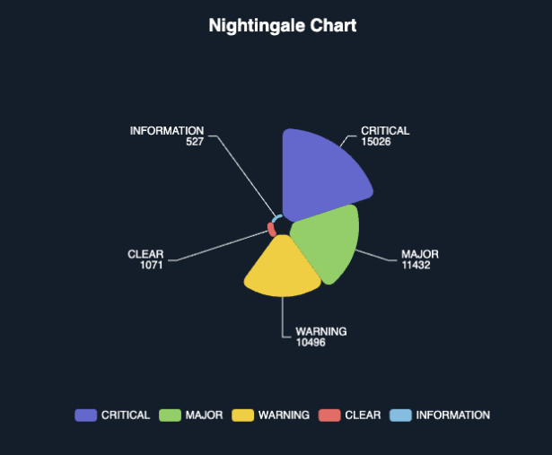

**Nightingale Chart using ECharts as a custom widget** 
This guide covers:

1. **Overview of the technology stack**  
2. **Purpose of the Nightingale chart**  
3. **Detailed JSON dashboard configuration**  
4. **The HTML file (custom widget) code**  
5. **Step-by-step explanation of the code**  
6. **How to adapt the chart to different requirements**  
---


## 1. Overview

**ECharts** is a powerful open-source visualization library that enables a wide variety of chart types, including pie charts, line charts, bar charts, and more specialized charts like the **Nightingale chart** (also known as a “rose” chart). 

Within the **CloudFabrix** platform, you can define **custom widgets** that leverage external JavaScript libraries. This allows you to fetch data from **persistent streams** (pstreams) and then render visualizations directly in your dashboards.

For example, when you have an alerts stream containing information about different alert severities, you can aggregate and display these severities in this chart.

---

## 2. What Is a Nightingale Chart and Why Use It?

A **Nightingale Chart** is a variant of a pie chart where slices can vary in radius (not just angle) based on their value. This layout is useful for:

- **Highlighting** differences between categories (via the slice radii).  
- **Visually engaging** design that stands out compared to standard pie charts.  
- **Flexibility** to show large or small magnitude differences distinctly.

In ECharts, you enable this style by setting:
```js
type: 'pie',
roseType: 'area' // or 'radius'
```
in the chart series configuration.

---

## 3. Dashboard JSON Configuration

Below is a simplified example of a dashboard JSON that demonstrates how to use the oia-alerts-stream persistent stream to fetch and aggregate alert severity data:

1. **Dashboard JSON** for the dashboard.  
2. A **section** with a custom widget referencing our Nightingale chart.  
3. A **custom widget definition** pointing to the HTML file that renders the chart.

```jsonc
{
  "name": "alerts-and-incidents-analytics",
  "label": "Alerts Analytics",
  "description": "Alert Insights",
  "dashboard_folder": "Training",
  "version": "1.0.0",
  "enabled": false,
  "stream": "oia-alerts-stream",
  "default_storyboard": "Training",
  "use_storyboard": true,
  "dashboard_type": "dashboard",
  "live_edit": true,
  "dashboard_filters": {
      "time_filter": true,
      "default_time_filter_labels": [
          "Last 12 months"
      ]
  },
  "dashboard_sections": [
    {
      "title": "Alerts and Incidents Analytics (Mktg Test)",
      "show_filter": true,
      "widgets": [
        {
          "title": "Alerts By Severity",
          "widget_type": "custom_widget",
          "widget_implementation": "alerts-and-incidents-analytics/nightingale_chart",
          "height": 6,
          "min_width": 6,
          "max_width": 6
        }
      ]
    }
  ],
  "custom_widgets": {
    "nightingale_chart": {
      "artifacts": {
        "main": {
          "attachment": "nightingale_chart.html",
          "content_type": "text/html",
          "is_template": true
        }
      }
    }
  }
}
```

### Key Sections

- **dashboard_sections** → **widgets**  
  Defines the actual widget to be displayed in the dashboard. Notice `widget_implementation` points to `alerts-and-incidents-analytics-mktg-test/nightingale_chart`, which corresponds to our custom widget name.

- **custom_widgets** → **nightingale_chart**  
  Informs the system there is a custom widget named `nightingale_chart`. The `"main"` artifact references an HTML file (`nightingale_chart.html`) in my attachments section that is used to render the chart.

---

## 4. The Custom Widget HTML (Nightingale Chart)

Below is a sample `nightingale_chart.html` which:

1. Loads the **ECharts** library.  
2. Fetches grouped data from the `oia-alerts-stream` using the CloudFabrix API.  
3. Processes the JSON response to build a rose-type pie chart.

```html
<!DOCTYPE html>
<html lang="en">
<head>
  <meta charset="UTF-8" />
  <title>Nightingale Chart</title>
  <style>
    /* Make the container occupy full screen, dark background */
    html, body {
      margin: 0;
      padding: 0;
      width: 100vw;
      height: 100vh;
      background: #101F2A;
      overflow: hidden;
      font-family: Arial, sans-serif;
    }
    /* ECharts container to place the chart in the center */
    #chart {
      width: 800px;
      height: 500px;
      margin: 40px auto;
      background: transparent;
    }
  </style>
</head>
<body>
  <!-- This DIV element is where ECharts will render the visualization -->
  <div id="chart"></div>

  <!-- Load ECharts from a CDN -->
  <script src="https://cdn.jsdelivr.net/npm/echarts@5/dist/echarts.min.js"></script>

  <script>
    // 1) Initialize ECharts
    const chartDom = document.getElementById('chart');
    const myChart = echarts.init(chartDom);

    // 2) Define the list of severities we want to display
    const desiredSeverities = ['CRITICAL', 'WARNING', 'INFORMATION', 'MAJOR', 'CLEAR'];

    /**
     * updateChart renders the final chart once data is ready.
     * @param {Array} dataArray - Array of { name, value } objects for ECharts
     */
    function updateChart(dataArray) {
      // Configure the Nightingale (rose) chart
      const option = {
        backgroundColor: 'transparent',
        title: {
          text: 'Nightingale Chart - Filtered Severities',
          left: 'center',
          top: '2%',
          textStyle: {
            color: '#ffffff',
            fontSize: 20,
            fontWeight: 'bold'
          }
        },
        tooltip: {
          trigger: 'item',
          formatter: '{a} <br/>{b}: {c} ({d}%)',
          backgroundColor: 'rgba(50,50,50,0.7)',
          textStyle: {
            color: '#ffffff'
          }
        },
        legend: {
          orient: 'horizontal',
          bottom: '5%',
          left: 'center',
          textStyle: {
            color: '#ffffff',
            fontSize: 12
          }
        },
        series: [
          {
            name: 'Aggregated Severity',
            type: 'pie',
            // 'roseType' enables the rose-chart style
            roseType: 'area',
            radius: [10, 110],
            center: ['50%', '50%'],
            itemStyle: {
              borderRadius: 8
            },
            // Helps avoid label overlap
            avoidLabelOverlap: true,
            labelLayout: { hideOverlap: true },
            label: {
              color: '#ffffff',
              fontSize: 12,
              formatter: '{b}\n{c}' // display name + count
            },
            labelLine: {
              length: 15,
              length2: 10,
              lineStyle: { color: '#ffffff' }
            },
            data: dataArray
          }
        ]
      };

      // Render the chart
      myChart.setOption(option);
    }

    // 3) Build the API URL to fetch aggregated data from the persistent stream
    //    group_by=a_severity and sum the 'count_' column for each severity
    const apiUrl = '/api/v2/pstreams/pstream/oia-alerts-stream/data'
      + '?cfxql_query=*' // fetch all data (no additional filter)
      + '&group_by=a_severity'
      + '&aggs=sum%3Acount_%3Acount__sum'
      + '&offset=0&limit=100';

    // 4) Fetch data via the CloudFabrix pstream API
    fetch(apiUrl, {
      headers: { 'accept': 'application/json' }
    })
      .then(response => {
        if (!response.ok) {
          throw new Error('Failed to load data: ' + response.statusText);
        }
        return response.json();
      })
      .then(data => {
        let chartData = [];

        // 5) Process the API response
        //    data.pstream_data should be an array of rows, each with "a_severity" and "count__sum"
        if (data && data.pstream_data && data.pstream_data.length > 0) {
          chartData = data.pstream_data
            .filter(row => desiredSeverities.includes(row.a_severity))
            .map(row => ({
              name: row.a_severity,
              value: Number(row.count__sum) || 0
            }));
        }

        // 6) Update the chart with the processed data
        updateChart(chartData);
      })
      .catch(error => {
        console.error('Error during fetch or data processing:', error);
      });

    // 7) Make the chart responsive
    window.addEventListener('resize', () => {
      myChart.resize();
    });
  </script>
</body>
</html>
```

---

## 5. Step-by-Step Explanation of Key Sections

1. **HTML & CSS Setup**  
   - A `<div id="chart"></div>` is defined to hold the chart.  
   - Basic styles make the page fill the screen with a dark background.

2. **ECharts Script**  
   - The line `<script src="https://cdn.jsdelivr.net/npm/echarts@5/dist/echarts.min.js"></script>` loads ECharts from a CDN.  

3. **Initialization**  
   ```js
   const chartDom = document.getElementById('chart');
   const myChart = echarts.init(chartDom);
   ```
   This prepares the ECharts instance within the specified container.

4. **Fetching Data**  
   ```js
   fetch(apiUrl, { headers: { 'accept': 'application/json' } })
     .then(response => response.json())
     ...
   ```
   - The `apiUrl` references the CloudFabrix endpoint.  
   - We pass `?cfxql_query=*` to fetch all records.  
   - We use `group_by=a_severity` and `aggs=sum:count_:count__sum` to get aggregated counts per severity.

5. **Filtering & Transforming**  
   ```js
   .filter(row => desiredSeverities.includes(row.a_severity))
   .map(row => ({
       name: row.a_severity,
       value: Number(row.count__sum) || 0
   }));
   ```
   - We only keep severities that match an array of interest: `[ 'CRITICAL', 'WARNING', ... ]`.  
   - We convert each row into the ECharts format: `{ name, value }`.

6. **Nightingale (Rose) Chart Configuration**  
   ```js
   series: [
     {
       type: 'pie',
       roseType: 'area',
       ...
     }
   ]
   ```
   - Setting `roseType` to `'area'` results in the “rose” style slices.

7. **Rendering and Responsiveness**  
   - `myChart.setOption(option);` draws the chart.  
   - An event listener triggers `myChart.resize()` on window resize, ensuring the visualization adapts to the new dimensions.

---

## 6. Adapting for Your Own Requirements

While the above example is tailored to `oia-alerts-stream`, you can easily adapt it:

1. **Use a Different Persistent Stream**  
   - Change the `apiUrl` to match your own stream name, for example:
     ```js
     const apiUrl = '/api/v2/pstreams/pstream/my-custom-stream/data?...';
     ```

2. **Apply Different Filters**  
   - You can adjust the query to fetch only the data you need.

3. **Group by Another Field**  
   - Replace `group_by=a_severity` with `group_by=<your_column>`.  
   - Adjust how you filter the returned data in JavaScript.

4. **Use Other Aggregations**  
   - If you need a different aggregation (like `value_count`, `avg`, or `max`), change `&aggs=sum%3Acount_%3Acount__sum` accordingly (e.g. `&aggs=value_count:somefield:field_count`).

5. **Update the Chart Type**  
   - If you prefer a standard pie chart, remove `roseType: 'area'`.

6. **Styling**  
   - You can modify colors, legends, and label styles in the `option` object.  
   - The background color can be changed by replacing `background: #101F2A;` in CSS with any preferred color.

---

## 7. Conclusion

By combining **ECharts** with the **CloudFabrix Persistent Stream**, you can create a variety of custom data visualizations, including a Nightingale chart. The main steps involve:

1. **Configuring** a dashboard JSON to include a custom widget.  
2. **Creating** an HTML file that loads ECharts and fetches data from the persistent stream.  
3. **Transforming** that data for your chart type (in this case, a Nightingale pie).  
4. **Customizing** the layout, style, and filters to meet your analytics needs.

This approach provides a flexible way to visualize your real-time or historical data, ensuring that you can adapt the chart to different fields, queries, and aggregation types. You can expand further with additional ECharts features (animations, theming, interactive tooltips) to deliver an even more engaging user experience.