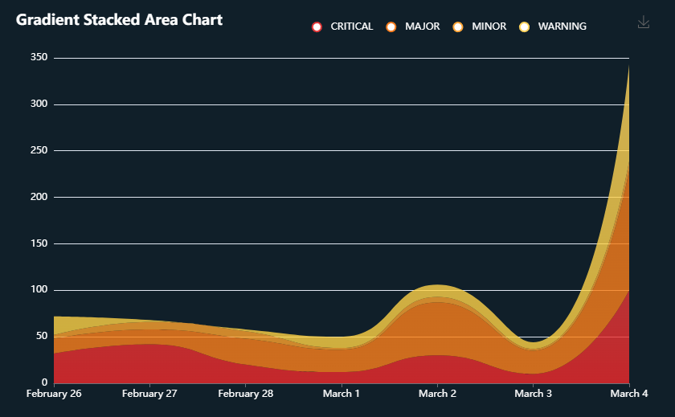

# Gradient Stacked Area Chart Custom Widget

This widget uses the [gradient stacked area chart](https://echarts.apache.org/examples/en/editor.html?c=area-stack-gradient) from 
[ECharts](https://echarts.apache.org/en/index.html) to easily visualize incidents from the last 7 days.



## How the Widget Works
The widget queries the `oia-alerts-stream` stream using the CloudFabrix persistent stream API
7 times, once for each day in the past 7 days. The API request specifies to group the results by
`a_severity` and sum the results. The API will respond with JSON which looks something like:
```json
{
  ...
  "pstream_data": [
    {
      "a_severity": "MAJOR",
      "count__sum": 26.0
    },
    {
      "a_severity": "CRITICAL",
      "count__sum": 15.0
    },
    {
      "a_severity": "WARNING",
      "count__sum": 4.0
    },
    {
      "a_severity": "MINOR",
      "count__sum": 3.0
    }
  ]
}
```

This represents a set of points for that day in the graph. The results of the 7 queries are combined and
transformed into something usable by ECharts. 