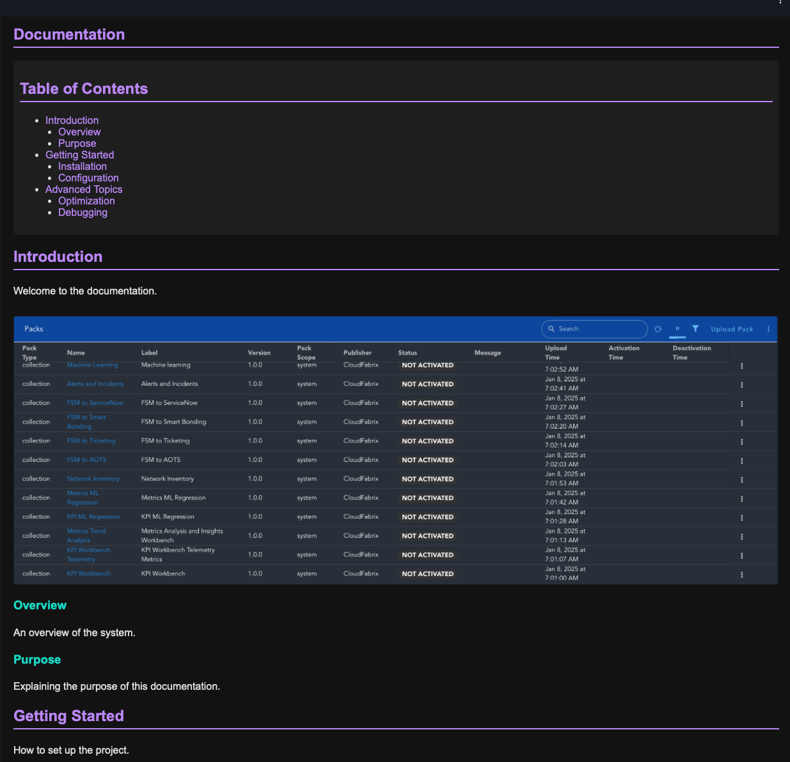

# About this widget

`documentation_widget` widget is an example widget that renders documentation as an RDAF Dashboard. Contents are dashboard loaded from YAML content that is typically provided as Dashboard attachment.



# Using the widget

Add contents of file `dashboard.json` as RDAF Dashboard.

# Adding Documentation to other RDAF dashboards (Apps)

Add a simple dashboard to the RDAF App that needs to show Documentation. It should have a single widget like below:

```json
{
    "title": "Documentation",
    "widget_type": "custom_widget",
    "widget_implementation": "dashboard_documentation/dashboard_documentation_widget",
    "min_width": 12,
    "min_height": 12,
    "fixed_variables": {
        "help_yaml_source_dashboard": "dashboard_documentation",
        "help_yaml_source_attachment": "exampleHelp1.yml",
        "help_title": "Documentation",
        "help_default": "{ \"sections\": [ { \"title\": \"Documentation not found\" } ] }"
    }
}

```

## Fixed variables
Fixed variables are used to customize this widget. 

### List of variables
- `help_yaml_source_dashboard`* (string) &rarr; Name of the dashboard that contains YAML content (which is used to render this Documentation dashboard)
- `help_yaml_source_attachment` (string) &rarr; Name of the attachment inside the dashboard specified by `help_yaml_source_dashboard`
- `help_title` (string) &rarr; Title for the documentation
- `help_default`: (string)&rarr; Default contents if YAML content could not be loaded.

\* required


## Example YAML

YAML content should be added as attachment in a dashboard.

```yaml
sections:
  - title: Introduction
    description: "Welcome to the documentation."
    image: "/iconpub/packs_table"
    subsections:
      - title: Overview
        description: "An overview of the system."
      - title: Purpose
        description: "Explaining the purpose of this documentation."
  - title: Getting Started
    description: "How to set up the project."
    subsections:
      - title: Installation
        description: "Steps to install."
      - title: Configuration
        description: "How to configure settings."
  - title: Advanced Topics
    description: "Deep dive into advanced features."
    subsections:
      - title: Optimization
        description: "Tips for optimizing performance."
      - title: Debugging
        description: "How to <b>troubleshoot</b> issues."

```

Note: If images need to be used inside the Documentation, they need to uploaded to RDAF Icon library. They can also be uploaded using `rdac` CLI or RDA Packs.
