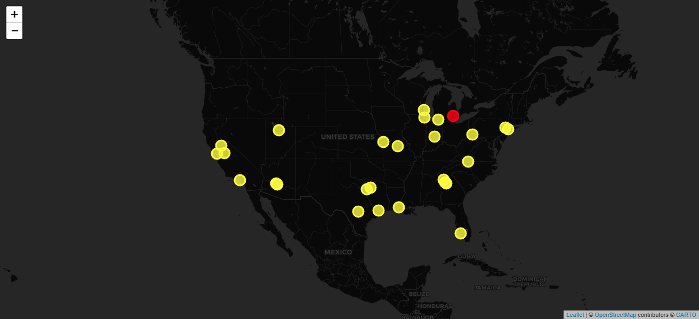

# GeoMap custom widget

This widget allows for adding colored points to an interactive map.



# Using the widget

## Fixed variables

Fixed variables are used to customize this widget.

### stream_name

The `stream_name` variable determines which stream to query for
count data.

### locations

The `locations` variable provides information on cities such as their
state and coordinates.

Example:

```json
"fixed_variables": {
  ...
  "locations": {
    "Detroit": {
      "state": "Michigan",
      "latitude": 42.3314,
      "longitude": -83.0458
    },
    "Kansas City": {
      "state": "Missouri",
      "latitude": 39.0997,
      "longitude": -94.5786
    }
  }
}
```

## Example usage in a dashboard
```json
{
  "title": "GeoMap",
  "widget_type": "custom_widget",
  "widget_implementation": "geomap/geomap",
  "min_width": 12,
  "min_height": 12,
  "widget_id": "4e2d532c",
  "fixed_variables": {
    "stream_name": "rum_stream",
    "locations": {
      "Detroit": {
        "state": "Michigan",
        "latitude": 42.3314,
        "longitude": -83.0458
      },
      "Kansas City": {
        "state": "Missouri",
        "latitude": 39.0997,
        "longitude": -94.5786
      },
      "Helotes": {
        "state": "Texas",
        "latitude": 29.578,
        "longitude": -98.6897
      },
      "Fort Worth": {
        "state": "Texas",
        "latitude": 32.7555,
        "longitude": -97.3308
      },
      "Highland Park": {
        "state": "Illinois",
        "latitude": 42.1817,
        "longitude": -87.8003
      },
      "Indianapolis": {
        "state": "Indiana",
        "latitude": 39.7684,
        "longitude": -86.1581
      },
      "New York": {
        "state": "New York",
        "latitude": 40.7128,
        "longitude": -74.006
      },
      "Estero": {
        "state": "Florida",
        "latitude": 26.4381,
        "longitude": -81.8068
      },
      "Fremont": {
        "state": "California",
        "latitude": 37.5483,
        "longitude": -121.9886
      },
      "Sandy": {
        "state": "Utah",
        "latitude": 40.564978,
        "longitude": -111.83819
      },
      "Houston": {
        "state": "Texas",
        "latitude": 29.7604,
        "longitude": -95.3698
      },
      "Los Angeles": {
        "state": "California",
        "latitude": 34.0522,
        "longitude": -118.2437
      },
      "Milwaukee": {
        "state": "Wisconsin",
        "latitude": 43.0389,
        "longitude": -87.9065
      },
      "Jefferson City": {
        "state": "Missouri",
        "latitude": 38.5767,
        "longitude": -92.1735
      },
      "Plano": {
        "state": "Texas",
        "latitude": 33.0198,
        "longitude": -96.6989
      },
      "Stockbridge": {
        "state": "Georgia",
        "latitude": 33.5443,
        "longitude": -84.2338
      },
      "Waterford": {
        "state": "California",
        "latitude": 37.6416,
        "longitude": -120.7605
      },
      "Denville": {
        "state": "New Jersey",
        "latitude": 40.8929,
        "longitude": -74.4771
      },
      "Peoria": {
        "state": "Arizona",
        "latitude": 33.5806,
        "longitude": -112.2374
      },
      "Phoenix": {
        "state": "Arizona",
        "latitude": 33.4484,
        "longitude": -112.074
      },
      "Rancho Cordova": {
        "state": "California",
        "latitude": 38.5891,
        "longitude": -121.3027
      },
      "Acworth": {
        "state": "Georgia",
        "latitude": 34.0659,
        "longitude": -84.6769
      },
      "Lafayette": {
        "state": "Louisiana",
        "latitude": 30.2241,
        "longitude": -92.0198
      },
      "Mount Airy": {
        "state": "North Carolina",
        "latitude": 36.4993,
        "longitude": -80.6073
      },
      "Atlanta": {
        "state": "Georgia",
        "latitude": 33.749,
        "longitude": -84.388
      },
      "California": {
        "state": "Pennsylvania",
        "latitude": 40.0651,
        "longitude": -79.8914
      },
      "Centreville": {
        "state": "Michigan",
        "latitude": 41.9212,
        "longitude": -85.5289
      }
    }
  }
}
```