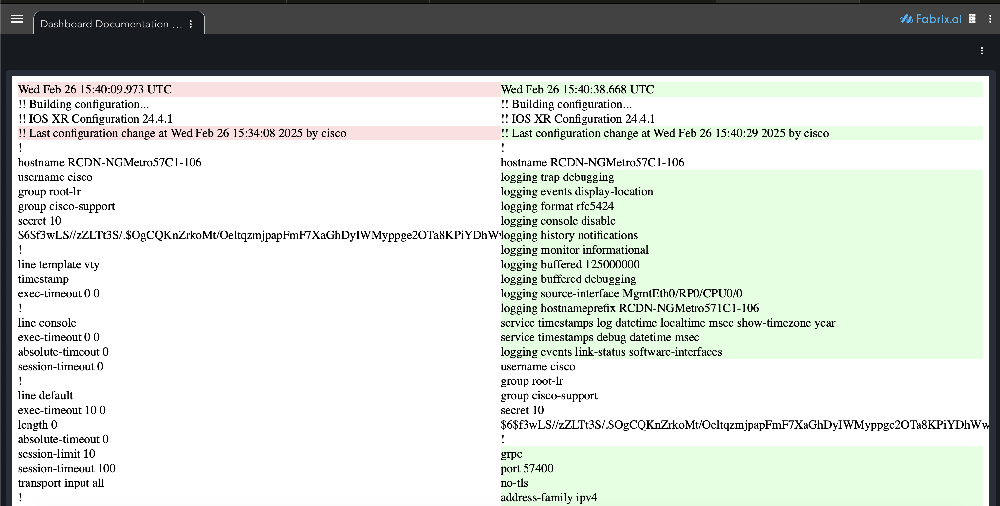

# Text Diff Custom Widget

This widget display a diff between 2 text contents side by side



# Using the widget

### text1

Variable containing the first text content. This should be passed as a context variable into the dashboard.
It is hardcoded in this example as a text1 attachment

### text2

Variable containing the second text content. This should be passed as a context variable into the dashboard.
It is hardcoded in this example as a text2 attachment

## Example usage in a dashboard
```json
                {
                    "title": "Documentation",
                    "widget_type": "custom_widget",
                    "widget_implementation": "dashboard_documentation/dashboard_documentation_widget",
                    "min_width": 12,
                    "min_height": 12,
                    "widget_id": "4e2d534c",
                    "fixed_variables": {
                        "help_yaml_source_dashboard": "dashboard_documentation",
                        "help_yaml_source_attachment": "exampleHelp1.yml",
                        "help_title": "Documentation",
                        "help_default": "{ \"sections\": [ { \"title\": \"Documentation not found\" } ] }"
                    }
                }
```
