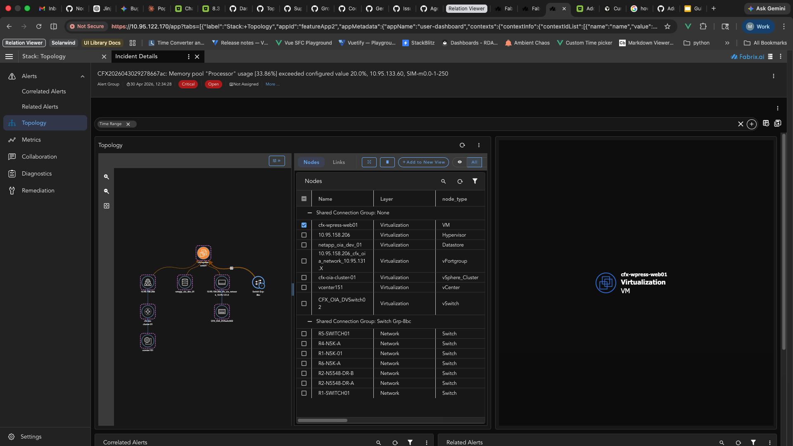
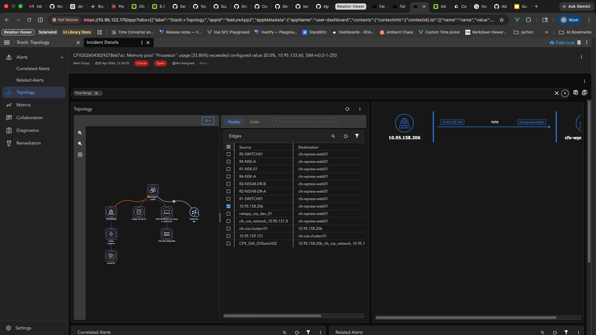
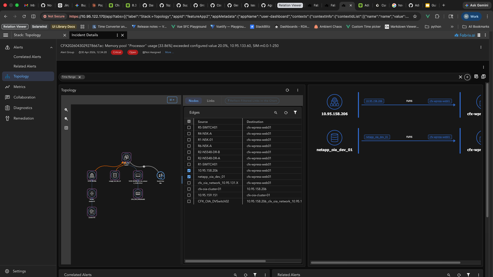
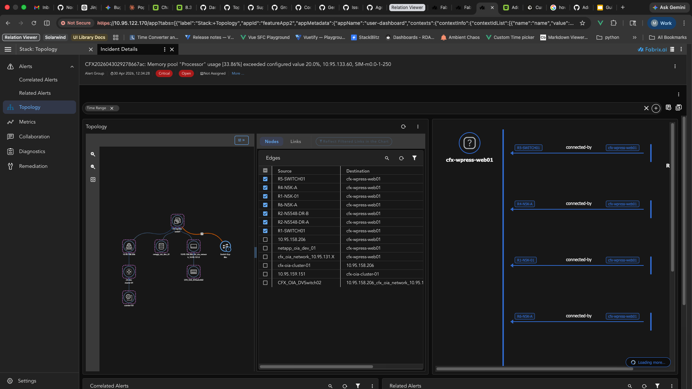

# Topology Selection Details Custom Widget

This widget renders topology relationship graphs and node detail cards inside an iframe. It reacts to whatever the user clicks in a connected topology or navigator widget, adapting its layout automatically.

## Files

| File | Role |
|---|---|
| [`main.html.j2`](./main.html.j2) | Main visual template — renders the iframe HTML, CSS, and JavaScript |
| [`query.json.j2`](./query.json.j2) | Data endpoint template — called by the widget's JavaScript to fetch topology chunks from `engine.get_topology_data` |

`main.html.j2` fetches topology data progressively (chunk by chunk) by making requests to `query.json.j2`. The first chunk is rendered immediately while subsequent chunks are merged in the background, indicated by a small loading pill. `data.json.j2` accepts topology parameters (stack name, node list, collections, chunk offset) via a base64-encoded query string.

---

## Widget use cases

### Use case 1 — Relationship view (`context.node_id` is set)

The widget is used as a **relationship view**. The user clicks a node from a node list in another widget (e.g. a three-column navigator), which pushes that node's ID into `context.node_id`. The selected node is rendered on the left as the focal point; every node it is connected to fans out as rows on the right.

`layout_mode = 'hub'`

### Use case 2 — Navigation context view (`navigatorWidgetContext` is set)

The widget is used as a **navigation context panel**. When the user clicks a node or edge(s) inside a topology widget, those objects are pushed into `navigatorWidgetContext`. The sub-layout depends on what was clicked:

#### Node selection — single node clicked



A compact node info card is rendered showing the node's icon, label, layer, type, and an optional HTML detail block. No topology data is fetched.

`layout_mode = 'nodeDetails'`

> If more than one node is selected, a prompt is shown asking the user to select a single node.

#### Single edge selection — one edge between two real nodes



A left–right strip is rendered for the selected edge, with the source node on the left and the destination node on the right. Interface labels and an edge center label are shown above the connecting line.

`layout_mode = 'edgeRows'`

#### Multi-edge selection — several edges selected at once



One left–right strip is rendered per unique node pair across all selected edges.

`layout_mode = 'edgeRows'`

#### Grouped edge selection — one or both sides are grouped nodes



- **1 groupNode endpoint** — the single real node renders on the left; all group members render as peer rows on the right.
- **2 groupNode endpoints** — a stack of mini-hubs is rendered, one per left-group member, with right-group peers repeated only when needed to avoid crossings.

`layout_mode = 'edgeRows'`

#### Idle state — nothing clicked yet

When `navigatorWidgetContext` is present but empty, an idle prompt is displayed asking the user to click a node or edge.

---

## Using the widget

### Fixed variables

Fixed variables are set in the dashboard JSON under `fixed_variables` and control the data source and display behaviour.

#### `stack_name` *(required unless set via context)*

The RDA stack name used to query topology data. Can alternatively be supplied at runtime via `context.attrs_stack_name`.

```json
"stack_name": "my-stack"
```

#### `nodes_collection`

The collection name to query nodes from.

```json
"nodes_collection": "network_nodes"
```

#### `edges_collection`

The collection name to query edges/relationships from.

```json
"edges_collection": "network_edges"
```

#### `graph_name`

The graph name to scope the topology query.

```json
"graph_name": "my_topology_graph"
```

#### `relation_map`

An optional relation map passed to the topology query to control which relation types are returned.

#### `attributeMap`

Controls which properties from relationship objects are mapped to visual elements. Each key corresponds to a UI role; the value is either a **string** (single property name) or an **array of strings** (fallback chain).

**String value** — looks up that property directly on the relationship object:

```json
"edgeCenterLabel": "link_type"
```

**Array value** — tries each property in order, returning the first non-empty value found:

```json
"nodeLabel": ["node_label", "hostname", "node_id"]
```

> **Special case for `nodeIcon`:** if the resolved value is an empty string or `"Not Available"`, the lookup continues to the next item in the array, eventually falling back to the default.

All keys resolve values from the relationship object's direct properties first, then from its `displayAttributes` array (as `displayAttributes[n].value` where `displayAttributes[n].key` matches).

**Supported keys and their defaults:**

| Key | Default | Description |
|---|---|---|
| `nodeLabel` | `["node_label", "hostname", "node_id"]` | Label shown below each node circle |
| `nodeIcon` | `"node_type"` | Property used to look up the node icon from the icon map |
| `edgeCenterLabel` | `"link_type"` | Text shown centred above the connecting line |
| `edgeSourceLabel` | `"local_port"` | Interface label near the source node |
| `edgeDestLabel` | `"remote_port"` | Interface label near the destination node |
| `edgeColor` | `"edge_color"` | Hex colour of the connecting line |
| `edgeSourceLabelColor` | `"source_label_outline_color"` | Border/text colour of the source interface badge |
| `edgeDestLabelColor` | `"dest_label_outline_color"` | Border/text colour of the destination interface badge |

---

## Registering the custom widget

Before the widget can be used in a dashboard, it must be registered in the dashboard JSON's top-level `custom_widgets` block. Both template files must be listed as artifacts — `main` for the visual HTML and `query.json` for the data endpoint:

```json
"custom_widgets": {
  "topology_selection_details": {
    "artifacts": {
      "main": {
        "attachment": "main.html.j2",
        "content_type": "text/html",
        "is_template": true
      },
      "query.json": {
        "attachment": "query.json.j2",
        "content_type": "application/json",
        "is_template": true
      }
    }
  }
}
```

The key under `custom_widgets` (`topology_selection_details` here) is the widget library name. It is combined with the artifact name to form the `widget_implementation` path used in individual widget definitions (e.g. `"topology_selection_details/topology_selection_details"`).

---

## Example usage in a dashboard

```json
{
  "title": "Topology Selection Details",
  "widget_type": "custom_widget",
  "widget_implementation": "topology_selection_details/topology_selection_details",
  "min_width": 12,
  "min_height": 8,
  "widget_id": "a1b2c3d4",
  "fixed_variables": {
    "stack_name": "my-stack",
    "nodes_collection": "network_nodes",
    "edges_collection": "network_edges",
    "graph_name": "my_topology_graph",
    "attributeMap": {
      "nodeLabel": ["node_label", "hostname", "node_id"],
      "nodeIcon": ["iconURL", "node_type"],
      "edgeCenterLabel": "link_type",
      "edgeSourceLabel": "local_port",
      "edgeDestLabel": "remote_port"
    }
  }
}
```

To wire the widget to a topology navigator widget so it reacts to clicks, set `navigatorWidgetContext` as the context source in your dashboard configuration, pointing to the navigator widget's output.
